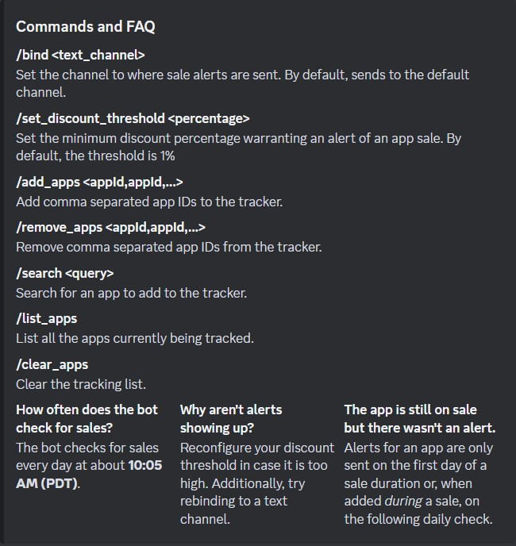
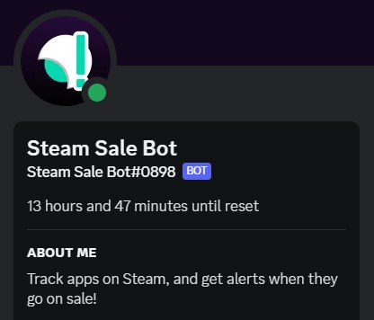
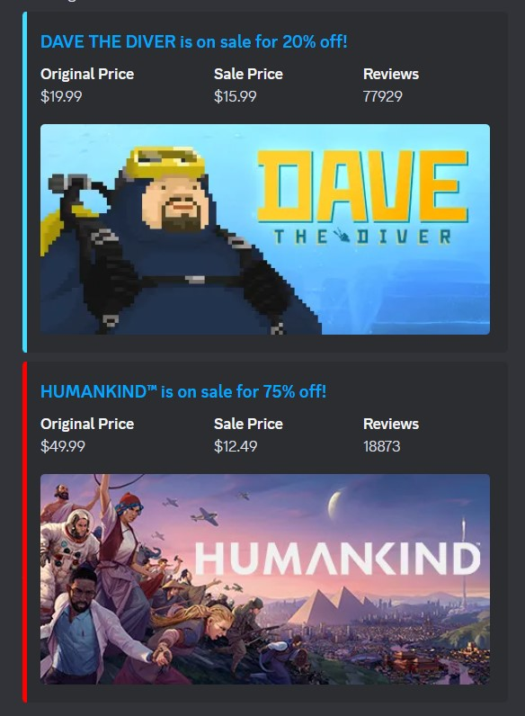
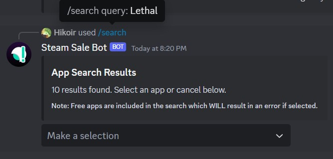
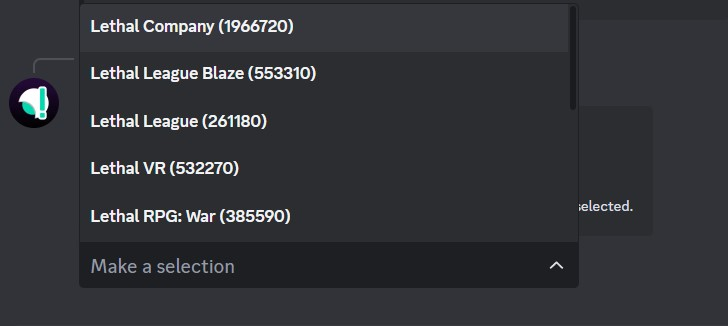

<h1 align="center">Steam Sale Bot</h1>

    

    A Java based Discord bot that tracks Steam apps of your choice and sends
    alerts when they go on sale.

<h2 align="center">
    <a href="https://discord.com/api/oauth2/authorize?client_id=1186785835866132540&permissions=51200&scope=bot" target="_blank">
        Invite Link
    </a>
</h2>

## Commands and FAQ

## Screenshots

## Technologies
- <b><a href="https://github.com/discord-jda/JDA" target="_blank">JDA</a></b> - A Java wrapper 
    for Discord's REST API and WebSocket-Events.
- <b><a href="https://github.com/Revadike/InternalSteamWebAPI" target="_blank">Steam's Internal Web API</a></b> -
    Community-driven documentation of the API can be accessed there.
- <b><a href="https://github.com/FasterXML/jackson" target="_blank">Jackson</a></b> - A Java JSON library. 
  Used for deserializing Steam's IWA endpoints.
- <b><a href="https://www.mongodb.com/" target="_blank">MongoDB</a></b> - A NoSQL database in the cloud for storage

## Authors
* [Jason Ly](https://github.com/jasonly027/)
* [My Nguyen](https://mynguyen.vercel.app/)
